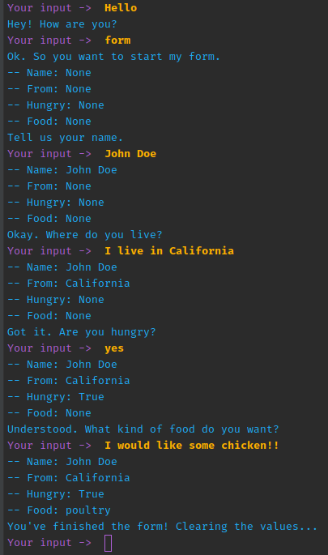
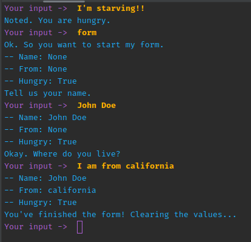

# Rasa form demo

Demo Rasa and slots extraction mechanisms found in Rasa forms.

It contains a form with 3 types of slots:
 - Plain text
 - From entity
 - From intent (done both as config and in the action server)

## Getting started

This project uses [pipenv](https://pipenv.pypa.io/en/latest/) to manage its dependencies:

```bash
pipenv install
```

This will install `rasa`, `spacy` and spacys's `en_core_web_md` dataset. 

Spacy is used to be able to detect entities related to places. Like countries and states.

## File structure

Most of these files are vanilla `rasa init` files, some of the notable changes are as follows:

- [data/nlu.yml](./data/nlu.yml) Defines the intentions related to start the form and user hungriness.
- [data/rules.yml](./data/rules.yml) Starts the form when detecting the right intentions and utters the hungriness feedback.
- [domain.yml](./domain.yml) Defines multiple details that piece together the actions. 
  - Adds intents (verbose).
  - Register entities we want to use ([GPE](https://spacy.io/usage/processing-pipelines#component-example3)).
  - Creates the form and the slots.
  - Adds some utterances to provide feedback.
  - Adds the `validate_my_form` to let Rasa know that this form is managed by the action server
- [actions/action.py](./actions/actions.py) Creates the form to provide some debug information and showcase the `extract_hungry` with intents
- [config.yml](./config.yml) Overrides the pipeline, adding `spacy` into the mix to be able to identify entities.
- [credentials.yml](./credentials.yml) Setup to be able to connect to the endpoints server.

## Training the model

Using Rasa CLI you can get your model trained:

```bash
pipenv run rasa train
```

## Starting

To try, you will need to run Rasa and Rasa actions

### Starting Rasa Actions

```bash
pipenv run rasa run actions
```

### Starting Rasa

The quickest way to try this model is to use `rasa shell`:

```bash
pipenv run rasa shell
```

A prompt will show asking for user input. Make sure Rasa actions server is running before starting.

## Demo

### Full form example

This example shows the form from start to end.




### Hungry before starting

In this example, we tell that we are hungry before starting the form. The value is stored in a slot
and is used by the form without altering it's status.



## References

- https://rasa.com/docs/rasa/forms/
- https://learning.rasa.com/conversational-ai-with-rasa/slots/
- https://rasa.com/docs/rasa/nlu-training-data/#entities
- https://rasa.com/docs/rasa/next/slot-validation-actions/
